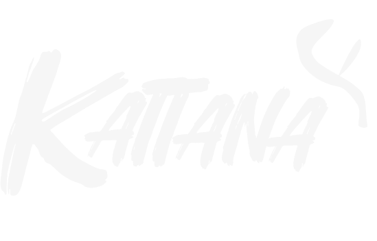

# Conta Kattana

<p align="center">
  
</p>

<p align="center">
  
  
</p>

A **Conta Kattana** e a central de identidade global da suite Kattana.

Este app concentra autenticação, credenciais, verificação de cadastro, perfil básico e os fluxos de handoff entre meus apps.

## Pra que serve 

- cadastro, login e logout da conta global
- reset de senha
- verificacao de e-mail
- edicao de perfil
- alteracao de senha
- autenticacao em dois fatores
- auth cross-app entre meus apps (uma conta, vários apps)

## Papel na arquitetura da suite

```text
Conta Kattana = identidade global
App cliente = dados do produto
Vinculo = uuid/global_uuid
```

- a Conta Kattana e a fonte de verdade da identidade
- apps clientes nao mantem senha separada
- os dados de dominio continuam no app cliente

## Stack

- Laravel 12
- PHP 8.4
- Laravel Fortify
- Inertia.js v2
- React 19
- TypeScript
- SQLite/PostgreSQL/MySQL via configuracao do Laravel

## Fluxo de integracao entre apps

```text
browser -> /apps/{app}/launch -> callback do app com code
backend do app -> /api/integrations/apps/{app}/exchange -> identidade
```

### Launch

```text
GET /apps/{app}/launch?return_to={url-absoluta}
```

- exige usuario autenticado
- exige e-mail verificado
- valida `return_to` por allowlist
- gera `code` de uso unico e expiracao curta
- redireciona o browser para `return_to?code=...`

### Exchange

```text
POST /api/integrations/apps/{app}/exchange
```

- autenticacao server-to-server via HTTP Basic
- valida `app_key` e `app_secret`
- valida `code`
- marca `code` como usado
- retorna payload padrao da identidade

Payload atual:

```json
{
  "data": {
    "uuid": "3fd15374-2f25-4c8c-a991-6c41f0aab8a4",
    "name": "Joao Silva",
    "email": "joao@kattana.com.br",
    "email_verified": true,
    "created_at": "2026-03-11T17:24:53+00:00"
  }
}
```

## Fluxo de verificacao de e-mail

Se o usuario iniciar o acesso a partir de um app integrado e ainda nao tiver e-mail verificado, a Conta Kattana preserva o contexto do `launch`.

Na pratica:

```text
App Cliente -> Conta Kattana -> cadastro/login -> verificar e-mail -> launch -> App Cliente
```

Ou seja: apos verificar o e-mail, o usuario volta ao app que iniciou o fluxo, e nao ao perfil interno da Conta Kattana.

## Endpoint de identidade

```text
GET /api/me
```

Uso recomendado:

- leitura da identidade autenticada dentro da propria Conta Kattana
- cenarios em que a sessao da Conta Kattana ja esta estabelecida

Nao use `/api/me` como mecanismo principal de integracao cross-app no browser. Para integracao entre apps, use `launch -> exchange`.

## Execucao local

```bash
composer install
npm install
cp .env.example .env
php artisan key:generate
php artisan migrate
npm run dev
```

Se preferir gerar assets para producao localmente:

```bash
npm run build
```

## Variaveis importantes

Exemplo minimo:

```env
APP_NAME="Conta Kattana"
APP_ENV=local
APP_URL=http://kattana-account.test

DB_CONNECTION=sqlite

ECONOMIZZE_APP_KEY=
ECONOMIZZE_APP_SECRET=
ECONOMIZZE_ALLOWED_RETURN_TO=http://economizze-v2.test/auth/kattana/
```

## Producao

Para deploy em `conta.kattana.com.br`, garanta no ambiente:

```env
APP_ENV=production
APP_DEBUG=false
APP_URL=https://conta.kattana.com.br
```

O projeto ja esta preparado para:

- forcar geracao de URL com `APP_URL` em producao
- forcar `https` em producao
- confiar em proxies via `X-Forwarded-*` no bootstrap, para cenarios com Cloudflare e proxy reverso

## Licenca

Este repositorio e disponibilizado sob a licenca **PolyForm Noncommercial 1.0.0**.

- Copyright (c) 2026 Joao Vitor Santos de Sena
- GitHub: [vitor-jotave](https://github.com/vitor-jotave)
- Uso pessoal e outros usos nao comerciais sao permitidos conforme os termos da licenca
- Uso comercial, revenda, relicenciamento comercial e comercializacao do projeto nao sao permitidos

Leia o arquivo [LICENSE](./LICENSE) para o texto integral.
